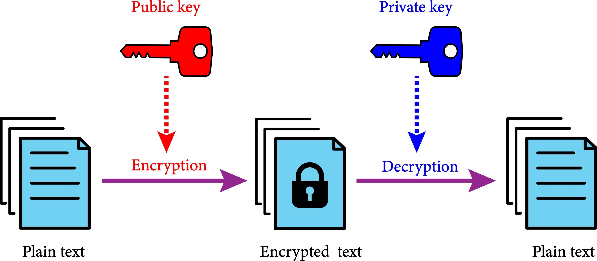
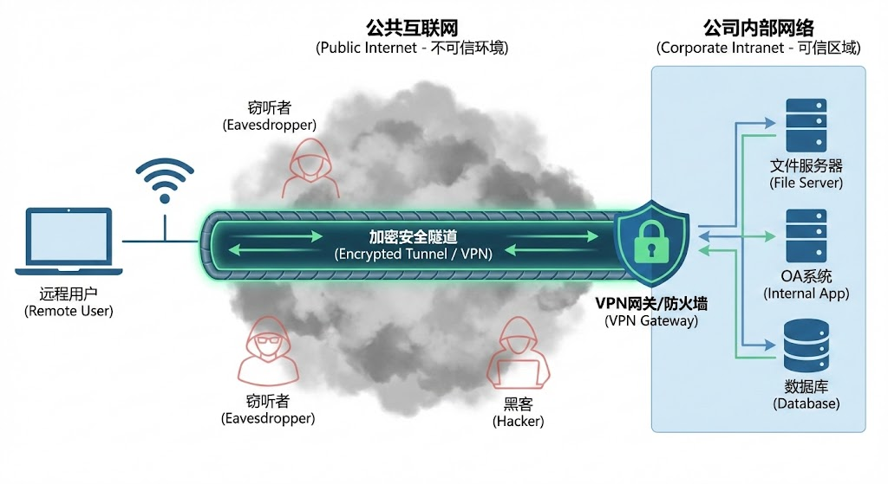
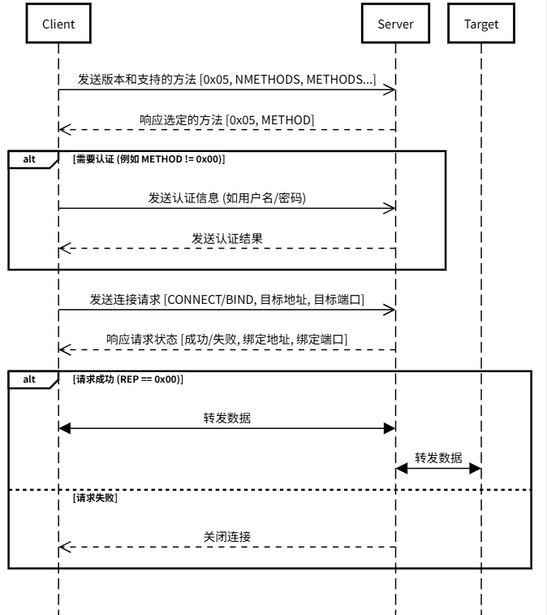
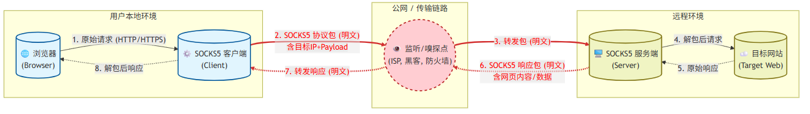
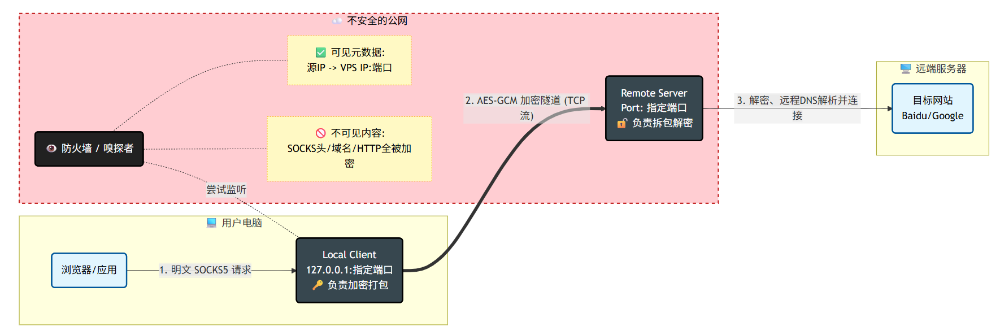
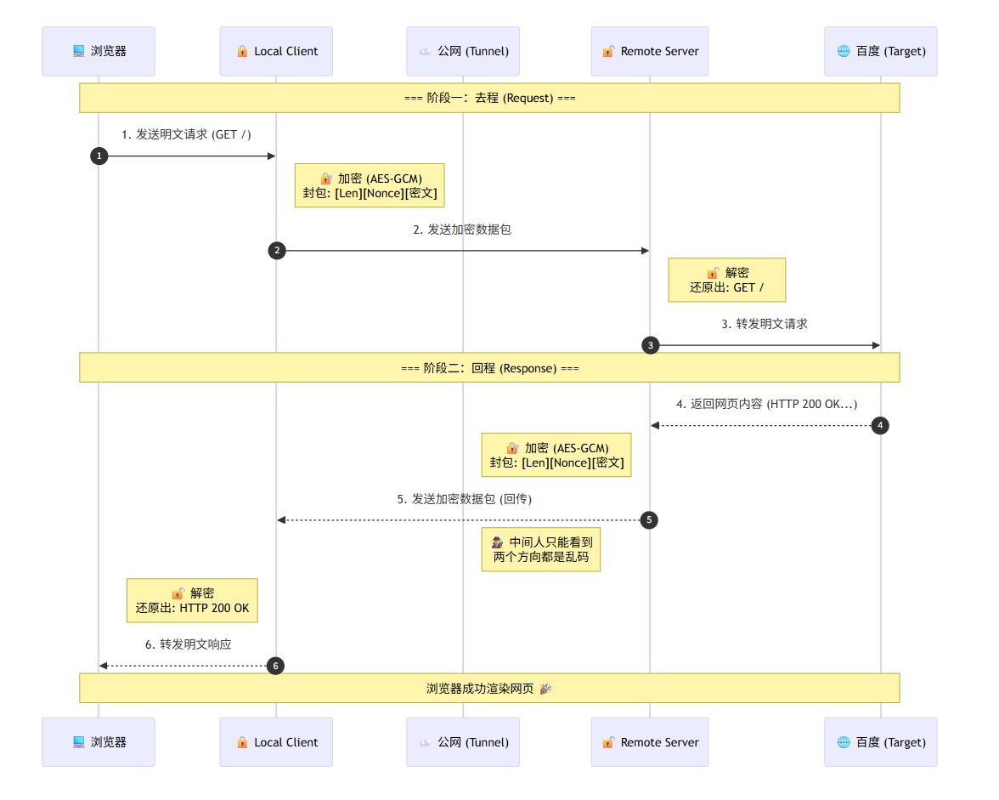

# 《不仅是代理：从零开始实现一个安全的TCP加密隧道》

## 一、为什么需要加密隧道 - CIA三要素

### 1.1 机密性 (Confidentiality)

这是加密隧道最根本的作用。互联网本质上是一个开放的网络，数据包在到达目的地的过程中会经过许多路由器和网关。

- **隧道的作用**: 数据在发送前被封装并加密。即使数据包被截获，看到的也只是一堆乱码。不使用隧道时，数据被明文传输，容易被中间人截获和窃听（被抓包）。
- **常见手段**：
    - **数据加密**： 使用对称加密算法（如 AES）或非对称加密算法（如 RSA）对数据进行加密。
      
    - **访问控制**： 只有授权用户才能建立隧道连接，防止未授权访问。
        - **身份认证** (Authentication): 确认你是谁。
        - **权限管理** (Authorization): 确认你能干什么。

### 1.2 完整性 (Integrity)

仅仅加密是不够的，我们还需要确保数据在传输过程中没有被修改。

- **隧道的作用**： 加密隧道协议（如 IPsec, SSH, TLS）通常包含消息认证码（MAC）或哈希校验。如果数据包在传输过程中被修改（无论是恶意的还是传输错误），接收端会检测到校验失败并丢弃该数据包。

- **常见手段**：

    - **哈希算法** (Hash)： 如 SHA-256。发送方计算数据的“指纹”（哈希值），接收方收到后重新计算并比对。如果哪怕变动了一个比特，哈希值也会完全不同。（比如在软件官网下载的安装包）

    - **数字签名**： 既能证明是谁发的，也能证明内容没被改过。（tls证书）
- **案例**：
    - 运营商http劫持投放广告
    - 运营商dns劫持修改解析地址

### 3. 可用性 (Availability)

可用性确保授权用户在**需要时**能够访问数据和资源。

- 场景：
    - 公司的内部资源（内网、数据库、文件服务器）通常受到防火墙保护，无法直接从外部互联网访问。
    - 突破限制，访问需要的资源
      

## 二、常见的加密隧道协议

### 2.1 IPsec (Internet Protocol Security)

IPsec 是最经典、应用最广泛的网络层 (Layer 3) 隧道协议。它直接在 IP 包层面进行加密，通常用于连接两个网络。

- **特点**： 是一套协议簇（包括 AH、ESP、IKE 等），标准严格，操作系统原生支持度高。

- **IKEv2** (Internet Key Exchange version 2): 目前 IPsec 中最主流的版本。

    - **优势**： 断线重连极快（非常适合手机在 Wi-Fi 和 4G/5G 间切换），安全性极高。

    - **劣势**： 配置相对复杂，容易被防火墙封锁（因为它使用特定的 UDP 端口 500/4500）。

- **适用场景**： 企业 Site-to-Site VPN（站点对站点）、iOS/Android 原生 VPN 功能。

### 2.2 SSL/TLS VPN

SSL/TLS VPN 工作在传输层 (Layer 4)，使用 SSL/TLS 协议进行加密，通常用于远程访问。

- **代表软件**： OpenVPN。

- **特点**： 它可以伪装成普通的 HTTPS 流量（TCP 443 端口）。

    - **优势**： 极难被防火墙发现和阻断，安全性久经考验，开源且高度可配置。

    - **劣势**： 相比 IPsec 和 WireGuard，因为协议开销大，速度稍慢，且需要安装第三方客户端（系统通常不内置）。

- **适用场景**： 员工远程办公、绕过严格的网络防火墙。

### 2.3 WireGuard

这是近几年异军突起的现代 VPN 协议，被 Linus Torvalds 称赞并直接合并进了 Linux 内核。

- **特点**： 代码极其精简（约 4000 行代码，而 OpenVPN/IPsec 有几十万行），采用最新的加密算法（如 ChaCha20）。

    - **优势**： 速度极快（目前最快的隧道协议），连接建立瞬间完成，非常省电（适合移动设备）。

    - **劣势**： 隐私设计上默认会记录 IP（需要上层应用做额外处理才能用于商业 VPN），目前在某些老旧系统上支持不如 OpenVPN 广泛。

- **适用场景**： 追求极致速度的个人 VPN、极客组网、由于其轻量级也被用于物联网（IoT）设备。

### 2.4 SSH Tunnel (Secure Shell)

SSH 主要用于远程登录服务器，但它强大的**端口转发（Port Forwarding）**功能使它成为一种便捷的临时隧道。

- **特点**： 无需搭建复杂的 VPN 服务端，只要有 SSH 权限就能用。

- **三种模式**：

    - **本地转发** (-L): 把访问本地某个端口的流量，通过 SSH 隧道转发到远程服务器的内网去。（例如：在家里访问公司内网的数据库）。

    - **远程转发** (-R): 让外网能访问内网服务（内网穿透）。

    - **动态转发** (-D): 建立一个 SOCKS5 代理，让浏览器所有流量都走 SSH 隧道。

- **适用场景**： 开发者调试数据库、临时访问内网服务、简单的代理上网。

### 2.5 PPTP 和 L2TP

老古董协议，有的老旧的路由器里还能看到，但正在逐渐退出历史舞台。

- PPTP: 微软早年开发的。极其不安全，加密很容易被破解。现在的苹果设备甚至已经移除了对它的支持。

- L2TP (Layer 2 Tunneling Protocol): 本身不加密，通常必须搭配 IPsec 使用（L2TP/IPsec）。虽然比 PPTP 安全，但效率低（双重封装），且容易被防火墙阻断。

## 三、实现一个简单的加密隧道

在这一部分，我们将从零开始实现一个简单的 TCP 加密隧道。我们将使用 Python 的 `socket` 模块来处理网络通信，使用
`cryptography` 库来进行加密和解密。

### 3.1 RFC 1928: SOCKS 协议第五版

> https://luyuhuang.tech/2020/08/27/rfc1928.html



**DNS解析方式**

- **远程DNS解析**: 客户端将域名发送给代理服务器，由代理服务器进行DNS解析并连接目标服务器。这种方式可以防止本地DNS泄露用户的访问意图，提高隐私性。
- **本地DNS解析**: 客户端在本地进行DNS解析，然后将解析后的IP地址发送给代理服务器。这种方式可能会暴露用户的访问意图（或者解析到错误的IP地址），因为DNS查询会经过本地网络。
    - **DNS加密**: 使用 DNS over HTTPS (DoH) 或 DNS over TLS (DoT) 等技术对DNS查询进行加密，防止DNS查询被窃听或篡改。

### 3.2 SOCKS5服务端

按照上述协议，完成代码实现后，使用以下命令测试：

- 远程dns
  > curl.exe --socks5-hostname 127.0.0.1:10110 http://www.baidu.com

  ```log
  [+] Accepted connection from 127.0.0.1:50728
  [+] Client supported methods: b'\x00\x01'
  [+] Request: CMD=1, ADDR=www.baidu.com, PORT=80
  ```
- 本地dns
  > curl.exe --socks5 127.0.0.1:10110 http://www.baidu.com
  ```log
  [+] Accepted connection from 127.0.0.1:50728
  [+] Client supported methods: b'\x00\x01'
  [+] Request: CMD=1, ADDR=223.109.82.212, PORT=80
  ```

**核心代码**：

```python
import threading


# 启动数据转发线程
def start_pipe(client_socket, remote):
    t1 = threading.Thread(target=forward, args=(client_socket, remote))
    t2 = threading.Thread(target=forward, args=(remote, client_socket))
    t1.start()
    t2.start()


# 数据转发函数
def forward(client_socks, remote):
    while True:
        try:
            data = client_socks.recv(4096)
            # hexdump(data)
            if not data:
                break
            remote.sendall(data)
        except ConnectionAbortedError:
            break
    client_socks.close()
    remote.close()
```

### 3.3 SOCKS5隧道

#### 3.3.1 设计思路



#### 3.3.2 逻辑改动

服务端逻辑保持不变，客户端逻辑需要做下列改动

- **握手与协商**:
    - **普通服务端**: 收到握手 -> 检查认证 -> 返回结果
    - **隧道客户端**: 收到握手 -> 直接返回无认证结果，然后向远程服务器发起握手请求。

- **请求打包**:
    - **普通服务端**: 解析请求 -> connect(目标) -> 开始转发
    - **隧道客户端**:
        - **不连接目标**，解析出浏览器想去哪（比如 baidu.com），但不连接。
        - **打包数据**：把目标地址（baidu.com）和后续的数据，打包塞进和 Remote 建立的连接里。

#### 3.3.3 核心代码变动

```python

import socket
import struct
import threading


# 转发目标地址和端口到远程服务器
def forward_target_addr_port_remote(local_socket, remote_socket):
    ver, cmd, rsv, atyp, addr, port = get_target_addr_port(local_socket)
    remote_socket.sendall(struct.pack("!BBBB", ver, cmd, rsv, atyp))
    if atyp == 1:  # IPv4
        remote_socket.sendall(socket.inet_aton(addr))
    elif atyp == 3:  # Domain name
        remote_socket.sendall(struct.pack("!B", len(addr)))
        remote_socket.sendall(addr.encode())
    remote_socket.sendall(struct.pack("!H", port))


# 启动管道
def start_pipe(local_socket, remote_socket):
    forward_target_addr_port_remote(local_socket, remote_socket)
    # 服务器连接响应
    data = remote_socket.recv(10)
    _, connect_state, _, _, _, _ = struct.unpack("!BBBBIH", data)
    if connect_state != 0:
        # 远程服务器连接目标失败
        print("[-] Remote server Connection to target failed")
        data = struct.pack("!BBBBIH", 5, 1, 0, 1, 0, 0)
        local_socket.sendall(data)
        return
    data = struct.pack("!BBBBIH", 5, 0, 0, 1, 0, 0)
    local_socket.sendall(data)
    t1 = threading.Thread(target=forward, args=(local_socket, remote_socket))
    t2 = threading.Thread(target=forward, args=(remote_socket, local_socket))
    t1.start()
    t2.start()
```

### 3.4 SOCKS5加密隧道

#### 3.4.1 设计思路




#### 3.4.2 加密算法选择

#### 3.4.2.1 算法选择逻辑

- **必须是对称加密（Symmetric）**：因为流量大，非对称（如 RSA）太慢，只能用于握手，不能用于传数据。
- **最好是流式加密（Stream Cipher）**：TCP 是流。如果选用块加密（Block Cipher）如 AES-CBC，需要凑齐 16
  字节才能发包，会导致延迟。
- **现代标准推荐 AEAD**：不仅加密，还能防篡改。

#### 3.4.2.2 推荐使用的算法

- **AES-256-GCM**
    - **地位**： 王者。PC 和服务器首选。
    - **特点**： 在有硬件加速（AES-NI）的 CPU 上跑得飞快。
- **ChaCha20-Poly1305**
    - **地位**： 挑战者。移动端（手机/树莓派）首选。
    - **特点**： Google大力推荐。它的设计初衷就是在没有 AES 硬件加速的芯片上也能跑得非常快（纯软件算法）。

#### 3.4.3 协议层改动

#### 3.4.3.1 数据流改动

- **普通隧道 (Raw Stream)**:

    - **模式**： TCP 是流式的。调用 send("hello")，对方 recv 到的就是 "hello"。

    - **特征**： 数据像自来水一样流过去，没有“包”的概念。

    - **代码行为**： data = sock.recv(4096)。读到多少算多少，直接转发。

- **加密隧道 (Framed Packets):**

    - **模式**： AES-GCM 算法要求必须拿到完整的一块密文和 Tag 才能解密。如果只读了一半，解密失败。

    - **特征**： 必须人为定义“一个包有多长”。

    - **改动点**： 引入了 TLV (Type-Length-Value) 思想，增加了 “包头”。

#### 3.4.3.2 封包结构变动

**[普通隧道的数据流]**

| HTTP GET / ... | Host: baidu.com ... |  <-- 没有任何界限

**[加密隧道的数据流]**
| Length (2B) | Nonce (12B) | Ciphertext (N bytes) | Tag (16B) |
| ---- | ---- | ---- | ---- |
|__告知包长__|__防重放随机数__|__真正的数据(加密)__|__防篡改签名__|

#### 3.4.3.3 逻辑变动

- **握手包加密**：客户端发起握手时，需要把握手包加密后再发给远程服务器。远程服务器解密后再进行正常的握手流程。如果解密失败，则直接丢弃连接。
- **目标地址加密**：目标服务器地址和端口也需要加密后发给远程服务器，远程服务器解密后再连接目标服务器。
- **数据包加密**：
    - 客户端在转发数据前，需要先把数据加密成一个完整的包（包含包头、Nonce、密文、Tag）
    - 发送给远程服务器。远程服务器收到后，先读取包头获取长度，然后读取完整的包进行解密和验证。如果解密失败或验证失败，则丢弃该包。
- **转发逻辑变更**：
    - **普通隧道**：客户端直接转发浏览器的数据到远程服务器，远程服务器直接转发到目标服务器。
    - **加密隧道**：客户端先加密数据包再转发到远程服务器，远程服务器解密后再转发到目标服务器。返回的数据也是一样，远程服务器先加密再发回客户端，客户端解密后再转发给浏览器。

#### 3.4.3.4 代码逻辑

##### 3.4.3.4.1 客户端

**握手逻辑**

```python
# 连接目标地址
def connect_target(addr, port):
    try:
        remote = socket.socket(socket.AF_INET, socket.SOCK_STREAM)
        remote.connect((addr, port))
        # 发送握手校验
        header, nonce, ciphertext = gcm_cipher.encrypt_packet(config['password'].encode())
        remote.sendall(header + nonce + ciphertext)
        print("[+] Sent handshake verification to remote server")
        # 发送版本号、NMETHODS、METHODS
        remote.sendall(struct.pack("!BBB", 5, 1, 0))
        # 接收远程服务器的连接响应
        response = remote.recv(2)
        print(f"[+] Remote server connect response:", response)
        return remote
    except Exception as e:
        print(f"[-] Connection to target {addr}:{port} failed: {e}")
        return None
```

**转发逻辑**

```python
# 转发local发来的请求到remote
def local_forward(local_socket, remote_socket):
    while True:
        try:
            data = local_socket.recv(4096)
            if not data:
                break
            # 加密数据
            header, nonce, ciphertext = gcm_cipher.encrypt_packet(data)
            # 发送数据到远程
            remote_socket.sendall(header + nonce + ciphertext)
        except ConnectionAbortedError:
            break
    local_socket.close()
    remote_socket.close()


def remote_forward(remote_socket, local_socket):
    while True:
        try:
            # 从远程接收数据
            header = remote_socket.recv(2)
            if not header:
                break
            length = struct.unpack('!H', header)[0]
            nonce = remote_socket.recv(12)
            ciphertext = remote_socket.recv(length - 12)
            try:
                data = gcm_cipher.decrypt_packet(nonce + ciphertext)
                local_socket.sendall(data)
            except Exception as e:
                print(f"[-] Decryption failed: {e}")
                break
        except ConnectionAbortedError:
            break
    local_socket.close()
    remote_socket.close()
```

##### 3.4.3.4.2 服务端

服务端逻辑和客户端是反过来的，所以大体上和客户端的代码是一样的，只是加密和解密的地方对调了。额外增加了握手解密和目标地址解密的逻辑。下面是握手解密的代码

**握手解密**

```python
def handle_handshake(client_socket):
    # 接收握手密钥
    length_data = client_socket.recv(2)
    length = struct.unpack('!H', length_data)
    nonce = client_socket.recv(12)
    ciphertext = client_socket.recv(length[0] - 12)
    try:
        recv_password = gcm_cipher.decrypt_packet(nonce + ciphertext)
        if recv_password != config['password'].encode():
            print("[-] Authentication failed")
            return False
    except Exception:
        print(f"[-] Authentication failed")
        return False
    print("[+] Client authenticated successfully")
    # VER NMETHODS
    # 1   1
    ver, nmethods = client_socket.recv(2)
    if ver != 5:
        print("[-] Unsupported SOCKS version")
        return False
    methods = client_socket.recv(nmethods)
    print("[+] Client supported methods:", methods)
    if 0x00 not in set(methods):
        print("[-] No acceptable authentication methods")
        return False
    data = struct.pack('!BB', 5, 0)
    client_socket.sendall(data)
    return True
```

# 四、实际演示

在实际环境中运行上述代码，启动 SOCKS5 加密隧道服务端和客户端，然后配置浏览器或系统代理指向本地的 SOCKS5 客户端端口，即可实现加密的
TCP 流量转发。
这里使用curl代替浏览器。

# 五、Q&A

- Q: 为什么不直接用现成的 VPN 软件？
    - A1: 现成的软件通常功能复杂，配置繁琐。自己实现可以更好地理解底层原理，并根据需求定制功能。
    - A2: 给大家做演示
- Q: 加密隧道会不会影响速度？
    - A: 会有一定的开销，但现代加密算法和硬件加速可以将影响降到最低。
- Q: 如何保证密钥的安全？
    - A: 密钥管理是关键，可以使用密钥交换协议（如 Diffie-Hellman）来动态生成密钥，避免静态密钥泄露风险。
- Q: 为什么不用 HTTPS 代理？
    - A: HTTPS 保护内容但不保护元数据。SNI 泄露了目标域名，且 TCP 连接的目标 IP 也是公开的。隧道模式能隐藏这一切。